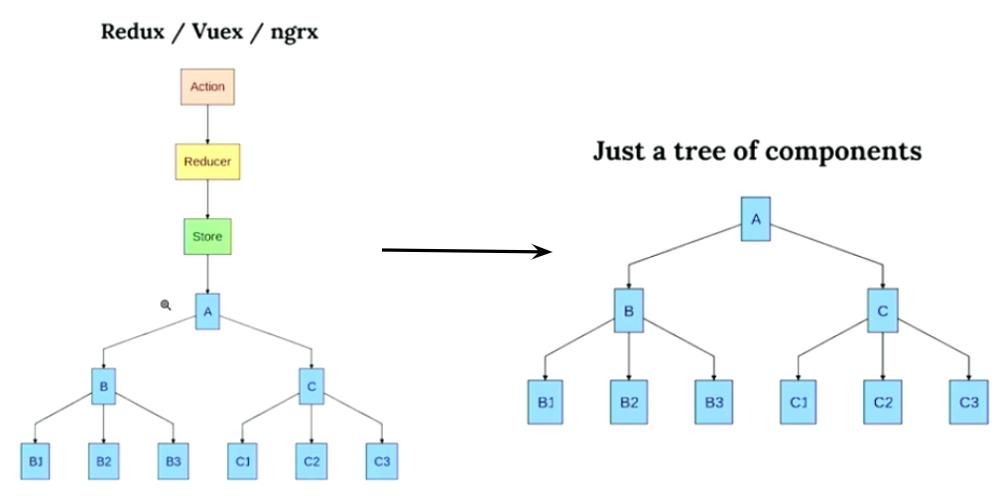

# BABE Rose Project(React.js, Node.js)

## Code samples

### registration-app/web/node/index.js
* handle events(websocket, express) as stream to manage complex sequential tasks: converting video to gif(ffmpeg), upload file to relay server, update google analytics and each tasks queued up per error for retry.

```javascript
const service = async () => {
    const {DEST_FOLDER, DB_PATH, logger, SERVER_URL, BAT_PATH} = await setupProject()
    const expressWs = require('express-ws')(app)
    app.use(express.static(path.resolve(__dirname, './build')))
    app.set('port', (process.env.PORT || 5000))
    const aWss = expressWs.getWss('/')
    const broadCast = (msg) =>{
        aWss.clients.forEach((client) => client.send(msg))
        return JSON.parse(msg)
     }
   /.../
    const qProcess = makeQProcess(logger, SERVER_URL)
    const gaProcess = makeGAProcess(logger, SERVER_URL)
    const Q = new DBQ(qProcess, {afterProcessDelay: 2000}, DB_PATH)
    const onReq$ = pipe(
        fromGetRoute(app, '/'),
        map(([req,res]) => res.sendFile(path.resolve(__dirname, './build', 'index.html')))
    )
    const ws$ = pipe(
        fromWS(app,'/'),
        map(msg => broadCast(msg)),
        filter(json => json.action === 'convert'),
        batchProcess(logger, BAT_PATH, DEST_FOLDER),
        map(d => {
            gaProcess(d)
            Q.add(d)
        })
    )
    const endpoints = merge(onReq$,ws$)
    forEach(emptyOP)(endpoints)

    app.listen(app.get('port'), function () {
        logger.debug(`[${getDateTime()}] NextNow services are running on port`.blue.bold, app.get('port'))
        Q.run()
    })
}
```
### registration-app/web/src/App.js
* used [use-profuctor-sate](https://github.com/staltz/use-profunctor-state) to avoid complexity of redux 
  
```javascript
const switchComp = (pro) => {
     switch (pro.state.path) {
        case '/':
            return <Idle {...pro}/>
        case '/reg':
            return <Registration {...pro}/>
        case '/select':
            return <FilterSelection {...pro}/>
        case '/ready':
            return <Ready {...pro}/>
        case '/count':
            return <CountDown {...pro}/>
        case '/preview':
            return <PreView {...pro}/>
        case '/thank':
            return <ThankYou {...pro}/>
        default:
            return <Idle {...pro}/>
    }
}

function App() {
    const sendWS = (msg) => rws.send(msg)
    const initState = {path:'/', data:{}, send:sendWS}
    //profunctor-state (functional lenses)
    const appProf = useProfunctorState(initState)
    const prof = appProf.promap(
        state => state,
        ({path,data}, state) => ({ ...state, path: path, data: data})
    )
    /.../
  return (
      <div>
          {switchComp(prof)}
      </div>
  )
}
```
### registration-app/web/src/comp/filterSelection.js
```javascript
function FilterSelection({ state, setState }) {
    const makeOnClickHandler = idx =>{
        return e => {
            state.send(JSON.stringify({id:'reg', action:'select', selection: idx,  preview:false}))
            //update parent state/props
            setState(pre => {
                return ({...pre, path:'/ready', data:{...pre.data, option:idx}})
            })
        }
    }
    return (/.../ )
}
```
### Diagram


### documentation
#### Photo booth app


[video](https://drive.google.com/open?id=1nS21Z_5DBJJN8jTX9O3tBR80uoGN8zYh)

#### landing page
[landing page doc](https://github.com/sendtogil/code-samples/tree/master/BABEROSE/landing-page-firebase)