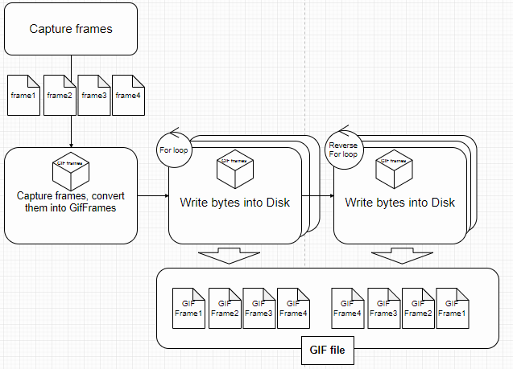
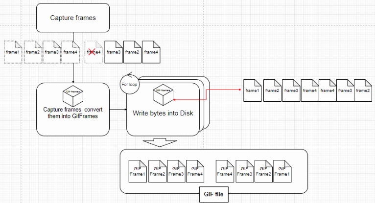
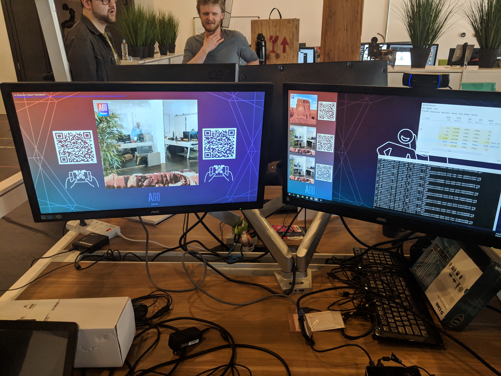
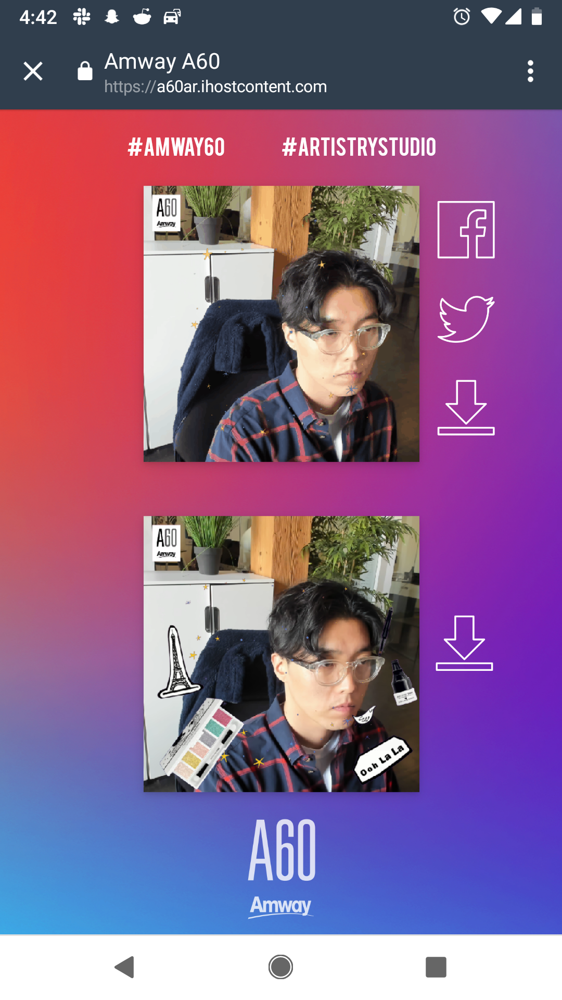

# Amway Project(Cycle.js)

## Code samples
#### react-ui/src/app.tsx
* separated view from main logic for easier debugging and modification
```javascript
export function responseView(response$,appName) {
  let getDisplayName = (name) =>{
    switch (name) {
      case 'xs': return '#LIVEXS'
      case 'beauty': return '#ARTISTRYSTUDIO'
      case 'icook': return '#AMWAYICOOK'
      case 'nutrition': return '#NUTRILITE'
      default : return '#AmwayA60'
    }
  }
  let appDisplayName = getDisplayName(appName)
  return response$.map(([imageRes,gifRes]) => {
    let imgPath = imageRes instanceof Error ? "./assets/loading.gif" : URL.createObjectURL(imageRes.body)
    let gifPath = gifRes instanceof Error ? "./assets/loading.gif" : URL.createObjectURL(gifRes.body)
    return makeGridlayout([
      h('div', {className: 'header_wrapper'}, [
        h('div', {className: "header_l"}, "#AmwayA60"),
        h('div', {className: "header_r"}, appDisplayName),
      ]),
      h('div', {className: 'content_wrapper'}, [
        h('div', {className: 'image_container'}, [
          h('div', {className: 'image_btn_wrapper'}, [
            h('img', {src: gifPath}),
            h('div', {className : 'button_wrapper'}, [
              h('div', {className : 'button_wrapper_inner'}, [
              FBButton(window.gifPath, appDisplayName),
              TWButton(window.gifPath, [appDisplayName,'#AmwayA60']),
              h('a', {href: gifPath, download: `${appDisplayName}.gif`}, [
                h('img', {className : 'btn',src: './assets/icon_Download.png'})
              ])
            ])
            ])
          ])
        ]),
        h('div', {className: 'image_container'}, [
          h('div', {className: 'image_btn_wrapper'}, [
            h('img', {src: imgPath}),
            h('div', {className : 'button_wrapper_right'}, [
              h('div', {className : 'button_wrapper_inner_right'}, [
              h('a', {href: imgPath, download: `${appDisplayName}.png`}, [
                h('img', {className : 'btn',src: './assets/icon_Download.png'}),
              ]),
              ])
            ]),
          ])
        ])
      ]),
      h('div', {className: 'logo_container'}, [
        h('img', {src: './assets/Amway_A60_logo.png'}),
      ]),
    ])
  })
}
```
####c-sharp-code/GifEncoder.cs
* Optimized open source [gif generator](https://github.com/Chman/Moments/tree/master/Moments%20Recorder/Scripts/Gif) to reduce processing time(10s -> 5s)
 ```c#
public IObservable<MemoryStream> GetGifStream(bool debug = false){
return Observable.Create<MemoryStream>(obs =>
{
    try
    {
        _memoryStream = new MemoryStream();
        WriteString("GIF89a"); //header
        _hasStarted = true;
    }
    catch (Exception e)
    {
        Debug.Log(e);
        obs.OnError(e);
    }

    var sw = new Stopwatch();
    if(debug) sw.Start();
    var gifFrames = _rawFrames.AsParallel()
        .Select(x => new GifFrame {Width = _width, Height = _height, Data = x})
        .ToList();
    var firstFrame = gifFrames[0];
    gifFrames.RemoveAt(0);
    AddFrame(firstFrame);
    var workerStreams = gifFrames.SplitList(_chunkSize).Select(frames =>
    {
        var w = new FrameWorker(frames, _sampleInterval,_frameDelay);
        return w.GetMemoryStream();
    });
    var parallel =
        Observable.WhenAll(workerStreams)
            .Subscribe(streams =>
            {
                if (!_hasStarted)
                    throw new InvalidOperationException("<Color=Red>[GetGifStream]Can't finish a non-started gif.</Color>");
                _hasStarted = false;
                try
                {
                    if(debug)Debug.Log($"<Color=yellow>[GetGifStream]merging memory streams b4 size{_memoryStream.Length}</Color>");
                    foreach (var memoryStream in streams)
                        memoryStream.CopyTo(_memoryStream);
                    var cnt = 0;
                    foreach (var memoryStream in streams)
                    {
                        memoryStream.Close();
                        memoryStream.Dispose();
                        if(debug)Debug.Log($"<Color=yellow>[GetGifStream]sub memory stream-{cnt++} has disposed</Color>");

                    }
                    _memoryStream.WriteByte(0x3b); // Gif trailer
                    _memoryStream.Position = 0;
                    if (debug)
                    {
                        Debug.Log($"<Color=yellow>[GetGifStream]merging memory streams after size{_memoryStream.Length}</Color>");
                        sw.Stop();
                        Debug.Log($"<Color=yellow>[GetGifStream]Total process time: {sw.Elapsed.Duration().ToString(@"m\:ss\.ff")}</Color>");
                    }
                    obs.OnNext(_memoryStream);
                    // Reset for subsequent use
                    _memoryStream = null;
                    _currentFrame = null;
                    _pixels = null;
                    _indexedPixels = null;
                    _colorTab = null;
                    _isFirstFrame = true;
                    obs.OnCompleted();
                }
                catch (Exception e)
                {
                    Debug.Log(e);
                    obs.OnError(e);
                }
            });
        return Disposable.Create(() =>
        {
            if(debug)Debug.Log("<Color=yellow>[GetGifStream] has been disposed</Color>");
            parallel.Dispose();
            sw = null;
        });
    });
}	

```
#### diagram
###### process flow of original version

 

###### process flow of optimized version

used memory stream to divide a heavy process into smaller chunks

 

### documentation
* [project log](https://drive.google.com/open?id=1_FNLEkTlt3Qpxq4VonpHcFzoK1tS_w1LoUaZiastDMk)
#### Photo booth app 

#### landing page
