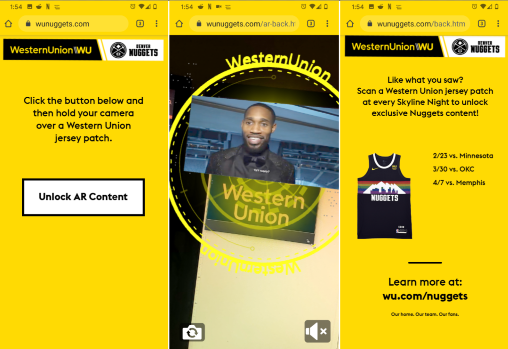

# Nugget-AR Project (A-frame, 8th wall)

### Code samples
* use [A-frame](https://aframe.io/), [8th wall](https://www.8thwall.com/) to track marker and anchor 3d object on it
```javascript
const videoPlayer = {
    schema: { video: { type: 'string' } },
    init: function () {
        const model_entity = $('#screen')
        const object3D = this.el.object3D
        const video = $(this.data.video)
        const videoTexture = new THREE.VideoTexture(video)
        let videoMat = new THREE.MeshBasicMaterial({color: 'white', transparent: false, opacity: 1, map: videoTexture})
        object3D.visible = false
        stopAnim(model_entity)

        this.el.addEventListener('model-loaded', () => {
            const obj = this.el.getObject3D('mesh');
            const anims = obj.animations
            animobj.start_anim = anims[0]
            animobj.idle_anim = anims[1]
            animobj.exit_anim = anims[2]
            animobj.clips = anims
            animobj.mixer = this.el.components["animation-mixer"]
            obj.traverse(node => {
                // if(node.isMesh)console.log(node.name)
                if(node.isMesh && node.name ==='Video_Screen'){
                    node.material = videoMat
                    animobj.node = node
                }
            })
        })

        this.el.addEventListener('animation-finished',function() {
            animobj.mixer.mixer.stopAllAction()
            if(animState === 'enter'){
                console.log('Entrance is done')
                video.play()
                isVideoStarted = true
                let anim = animobj.mixer.mixer.clipAction(animobj.idle_anim)
                anim.setLoop(THREE.LoopRepeat).reset().play()
                animState = 'idle'
                console.log('video should play')
            }
            if(animState === 'idle'){
                console.log('idle is playing')
            }
        },{once:false})

        video.ontimeupdate = function () {
            if(video.duration - video.currentTime < 0.2){
                video.pause()
                animobj.mixer.mixer.stopAllAction()
                window.location.href = './back.html';
                isPlayed2End = true
            }
        }
        let enableMarkersHandler;
        const showImage = ({ detail }) => {
            clearTimeout(enableMarkersHandler)
            if(!markerSelected){
                console.log('found marker: ',detail.name )
                XR8.XrController.configure({imageTargets: [detail.name]})
                markerSelected = true
            }

            if(isPlayed2End)return
            object3D.position.copy(detail.position)
            object3D.quaternion.copy(detail.rotation)
            object3D.scale.set(detail.scale, detail.scale, detail.scale)
            if (!object3D.visible) object3D.visible = true
            if(isVideoStarted) video.play()
            playAnim(model_entity)
        }
        const hideImage = ({ detail }) => {
            object3D.scale.set(3.5, 3.5, 3.5)
            enableMarkersHandler =
                setTimeout(() =>{
                    XR8.XrController.configure({imageTargets: ['gray-new', 'gray-old', 'white-new','white-old','test']})
                    console.log('all markers enabled')
                    markerSelected = false
                },5000)
        }
        this.el.sceneEl.addEventListener('xrimagefound', showImage)
        this.el.sceneEl.addEventListener('xrimageupdated', showImage)
        this.el.sceneEl.addEventListener('xrimagelost', hideImage)
    }
}
```

### documentation
#### App


[promotion video link](https://www.linkedin.com/posts/next-now_augmentedabrreality-ar-webar-activity-6610618956057235456-Mt6D)

#### live demo
[wunuggets](https://www.wunuggets.com/) - open this page on mobile then scan the below marker to start AR experience


