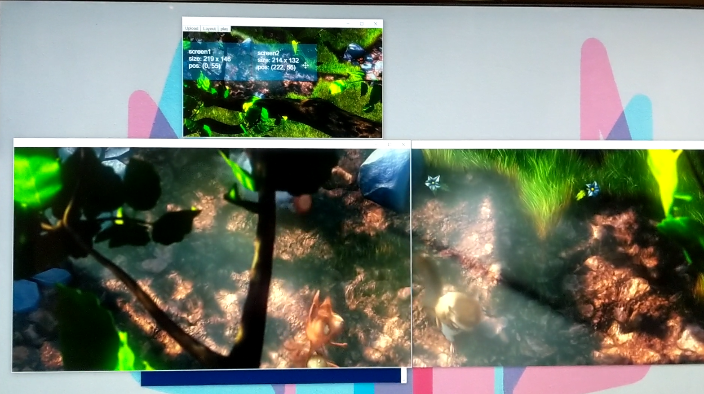

# United Project(React, Cycle.js)

### Code samples
#### src/components/VideoModule/VideoModule.js
* video play back syncing across multiple devices via websocket
```javascript
const mapVal =(value,min1,max1,min2,max2) =>{
    return min2 + (max2 - min2) * ((value - min1) / (max1 - min1))
}

function value_limit(val, min, max) {
    return val < min ? min : (val > max ? max : val);
}
class VideoModule extends Component {
/.../
handleData = (msg) =>{

        let video = this.video
        let status = msg.data.status
        let isMaster = this.props.config.id === '0' || this.props.config.id === 0


        if(!isMaster){
            if(status === 'swap' ){
                let video_index = msg.data.index
                this.setState({src: this.props.config.base_url +
                        this.props.clips[this.props.video_index[video_index]],index : video_index})
            }
            if(status === 'play' ) {
                let targetTime = msg.data.time
                let timeDiff = targetTime - video.currentTime
                let targetSpeed = mapVal(timeDiff, -0.1, 0.1, 0,2)

                if( Math.abs(timeDiff) > 0.3){
                    console.log("video.js","overwrite time-code",Math.abs(timeDiff))
                    video.currentTime = targetTime
                    video.playbackRate = 1
                }
                video.playbackRate =value_limit(targetSpeed,0,2)
            }
        }
    }
/.../
```
#### src/store/reducers.js
* used Redux to handle state & actions
  
```javascript
  const initialState = {
      mode : "empty",
      config : {},
      clips : [],
      MixClips : [],
      collage: {},
      collage_index: 0,
      video_index : [],
      mix_video_index : 0,
      mix : "",
      flag : "",
      stamp : "",
      error : ""
  }
  
  export const UPDATE_ERROR = (error) =>{
      return {type:'UPDATE_ERROR', payload : {error : error}}
  }
  export const UPDATE_MODE_CONFIG = (mode, config) =>{
       return {type:'UPDATE_MODE_CONFIG', payload : {mode : mode, config: config}}
  }
  export const UPDATE_MODE_JSON = (mode, json, time) =>{
    return {type:'UPDATE_MODE_JSON', payload : {mode : mode, json: json, localTime : time}}
  }
/.../
```
### documentations


[video link](https://drive.google.com/file/d/131bkVGwt7nFUXfbyp60v187QBLVoqB9R/view?usp=sharing)



[video link](https://drive.google.com/open?id=1RGg2jl6wCTsMjPEUYIDbvm4fFYlV7Rth)


